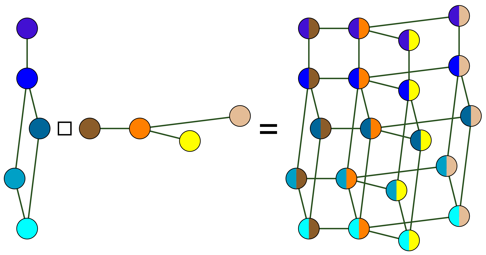

Мы уже рассмотрели некоторые операции, а именно, добавление и удаление рёбер из графа, удаление вершины из графа, объединение и пересечение графов, а также определили дизъюнктивное объединение графов. Для полноты картины приведём ещё ряд операций, применимых к графам.

**1) Дополнение графа.** Дополнением графа $G(V,E)$ называется граф $G_1(V,E_1)$, у которого множество вершин такое же, как у исходного графа, а множество рёбер представляет собой дополнение до множества $E$: $V_1=V$, $E_1=\overline{E}$. Вершины графа $G$ смежны только в том случае, когда они не смежны в исходном графе. Обозначение: $\overline{G}$ (Дополнение множества — это множество всех элементов, которые входят в "полное множество", но не пренадлежат множеству, которое дополняем).

> [!tip] Пояснение на картинках: дополнение графа
> Исходный граф $G$ — путь на четырёх вершинах, ниже — его дополнение $\overline{G}$:
>
> ```mermaid
> graph LR
>     1((1)) --- 2((2))
>     2 --- 3((3))
>     3 --- 4((4))
> ```
>
> ```mermaid
> graph LR
>     1((1)) --- 3((3))
>     1 --- 4((4))
>     2((2)) --- 4((4))
> ```
>
> Что есть что:
>
> - вершины те же самые: $\{1, 2, 3, 4\}$, меняем только рёбра;
> - рёбра «выворачиваются»: где ребро было — его нет, где не было — появилось. В $G$ рёбра $12, 23, 34$; в $\overline{G}$ — ровно остальные: $13, 14, 24$;
> - проверка: на 4 вершинах возможно $\binom{4}{2} = 6$ рёбер, поэтому вместе $G$ и $\overline{G}$ дают полный граф $K_4$ — каждое возможное ребро лежит ровно в одном из двух.

**2) Добавление вершины** $v$ в граф $G(V,E)$, $v \notin V$: во множество вершин добавляется вершина $v$, $V_1=V\cup{v}$, $E_1=E$. Обозначение: $G_1 = G+v$.

> [!tip] Пояснение на картинках: добавление вершины
> ```mermaid
> graph LR
>     1((1)) --- 2((2))
>     2 --- 3((3))
>     3 --- 1
>     v((v))
>     style v fill:#8ef
> ```
>
> Что есть что:
>
> - к треугольнику добавилась голубая вершина $v$ — и всё; рёбра не трогались ($E_1 = E$);
> - новая вершина добавляется **изолированной**: $\deg v = 0$, ни с кем не смежна;
> - чтобы $v$ «вросла» в граф, её нужно соединить рёбрами — этим займутся операции ниже.

**3) Отождествление вершин** $v_1, v_2$ графа $G(V,E)$: замена этой пары новой вершиной $v$, причём все рёбра, которые шли в удалённые вершины, заменяются рёбрами, ведущими в $v$. Если эти вершины были смежными, то отождествление называется стягиванием ребра.

> [!tip] Пояснение на картинках: отождествление вершин и стягивание ребра
> Сверху исходный граф: $v_1$ и $v_2$ смежны, красное ребро — то, которое стянем. Снизу — результат:
>
> ```mermaid
> graph LR
>     c((c)) --- v1((v1))
>     v1 === v2((v2))
>     v2 --- d((d))
>     v2 --- e((e))
>     linkStyle 1 stroke:#e15759,stroke-width:3px
> ```
>
> ```mermaid
> graph LR
>     c((c)) --- v((v))
>     v --- d((d))
>     v --- e((e))
>     style v fill:#8ef
> ```
>
> Что есть что:
>
> - пара $v_1, v_2$ слита в одну новую голубую вершину $v$;
> - все рёбра, шедшие в $v_1$ или $v_2$, теперь идут в $v$: остались связи с $c$, $d$, $e$;
> - само ребро $v_1v_2$ исчезло, петли на его месте не возникло;
> - раз вершины были смежны, это стягивание ребра $v_1v_2$; та же операция для несмежной пары — просто отождествление вершин.

**4) Стягивание графа** $G(V,E)$: из множества вершин удаляется подмножество $A$ и заменяется новой вершиной $v$, все рёбра, которые шли в вершины из $A$, заменяются рёбрами, ведущими в $v$.

$$ V_1 = V \setminus A \cup {v}, \qquad E_1 = {E \setminus {e = u\omega \mid u\in A \text{ или } \omega \in A}} \cup {e = uv \mid u \in N(A)\setminus A} $$

Обозначение: $G_1 = G \setminus A$.

> [!tip] Пояснение на картинках: стягивание графа
> Сверху исходный граф, жёлтым — подмножество $A = \{a, b, c\}$, которое сейчас схлопнется в одну вершину. Снизу — результат:
>
> ```mermaid
> graph LR
>     x((x)) --- a((a))
>     a --- b((b))
>     b --- c((c))
>     c --- a
>     c --- y((y))
>     style a fill:#ffe08a
>     style b fill:#ffe08a
>     style c fill:#ffe08a
> ```
>
> ```mermaid
> graph LR
>     x((x)) --- v((v))
>     v --- y((y))
>     style v fill:#8ef
> ```
>
> Что есть что:
>
> - весь жёлтый кусок заменён одной голубой вершиной $v$;
> - наружу из $A$ вели рёбра $xa$ и $cy$ — они переприкреплены к $v$: получились $xv$ и $vy$ (в формуле это вершины из $N(A) \setminus A$ — соседи $A$ снаружи);
> - рёбра внутри $A$ (треугольник $abc$) пропали: им некуда вести, оба конца теперь «внутри» $v$;
> - это то же отождествление из п. 3, только сразу для целого множества вершин.

**5) Подразбиение ребра** графа $G$: удаление ребра и добавление новой вершины, которая присоединяется рёбрами с каждой вершиной удалённого ребра.

> [!tip] Пояснение на картинках: подразбиение ребра
> Сверху исходный граф, красное ребро $uv$ удалим. Снизу — результат:
>
> ```mermaid
> graph LR
>     a((a)) --- u((u))
>     u === v((v))
>     v --- b((b))
>     linkStyle 1 stroke:#e15759,stroke-width:3px
> ```
>
> ```mermaid
> graph LR
>     a((a)) --- u((u))
>     u --- w((w))
>     w --- v((v))
>     v --- b((b))
>     style w fill:#8ef
> ```
>
> Что есть что:
>
> - ребро $uv$ выброшено, а на его место «посажена» новая голубая вершина $w$, соединённая с обоими бывшими концами: $uw$ и $wv$;
> - маршрут из $a$ в $b$ сохранился, просто стал на вершину длиннее: $a - u - w - v - b$;
> - смысл операции: поставить на ребро лишнюю точку. Граф «по сути» не меняется — два графа, получающиеся друг из друга такими подразбиениями, называют гомеоморфными.

**6) Размножение вершины** $v$ графа $G(V,E)$ (при условии $v' \notin V$): во множество вершин добавляется вершина $v'$, во множество рёбер — рёбра, соединяющие новую вершину $v'$ с вершиной $v$ и со всеми смежными с ней вершинами.

$$ V_1 = V\cup{v'}, \qquad E_1 = E \cup {e = vv' \mid v \in N(v)} $$

Обозначение: $G_1 = G \uparrow v$.

> [!tip] Пояснение на картинках: размножение вершины
> Сверху исходный граф: у вершины $v$ соседи $a$ и $b$. Снизу — результат размножения:
>
> ```mermaid
> graph LR
>     a((a)) --- v((v))
>     v --- b((b))
>     b --- c((c))
> ```
>
> ```mermaid
> graph LR
>     a((a)) --- v((v))
>     v --- b((b))
>     b --- c((c))
>     v --- vp((v'))
>     vp --- a
>     vp --- b
>     style vp fill:#8ef
>     linkStyle 3 stroke:#8ef,stroke-width:3px
>     linkStyle 4 stroke:#8ef,stroke-width:3px
>     linkStyle 5 stroke:#8ef,stroke-width:3px
> ```
>
> Что есть что:
>
> - добавилась голубая вершина $v'$ — «клон» $v$;
> - голубые рёбра — все новые: $v'v$, а также $v'a$ и $v'b$, то есть связи с самой $v$ и с **каждым** её соседом из $N(v)$;
> - отличие от отождествления (п. 3): там две вершины сливались в одну, здесь одна вершина раздаёт свою копию — связей становится больше, а не меньше.

**7) Соединение графов** $G_1(V_1,E_1)$ и $G_2(V_2,E_2)$ (при условии, что их множества вершин и множества рёбер не пересекаются) называется граф $G(V,E)$, в котором $V=V_1\cup V_2$, $E = E_1 \cup E_2 \cup {e = v_1v_2 \mid v_1\in V_1, v_2 \in V_2}$. Иными словами, строится объединение графов и добавляются рёбра, соединяющие графы $G_1(V_1,E_1)$ и $G_2(V_2,E_2)$. Обозначение: $G = G_1 + G_2$.

> [!tip] Пояснение на картинках: соединение графов
> Берём два графа с непересекающимися вершинами: треугольник $G_1$ и ребро $zx$ ($G_2$, жёлтое). Соединение — это объединение плюс **все возможные** рёбра между ними:
>
> ```mermaid
> graph LR
>     a((a)) --- b((b))
>     b --- c((c))
>     c --- a
>     z((z)) --- x((x))
>     style z fill:#ffe08a
>     style x fill:#ffe08a
> ```
>
> ```mermaid
> graph LR
>     a((a)) --- b((b))
>     b --- c((c))
>     c --- a
>     z --- x((x))
>     z --- a
>     z((z)) --- b
>     z --- c
>     x --- a
>     x --- b
>     x --- c
>     style z fill:#ffe08a
>     style x fill:#ffe08a
>     linkStyle 4 stroke:#8ef,stroke-width:3px
>     linkStyle 5 stroke:#8ef,stroke-width:3px
>     linkStyle 6 stroke:#8ef,stroke-width:3px
>     linkStyle 7 stroke:#8ef,stroke-width:3px
>     linkStyle 8 stroke:#8ef,stroke-width:3px
>     linkStyle 9 stroke:#8ef,stroke-width:3px
> ```
>
> Что есть что:
>
> - жёлтые вершины $z$ и $x$ — это второй граф; каждая из них соединена ребром с **каждой** вершиной треугольника: новые голубые рёбра $za$, $zb$, $zc$, $xa$, $xb$, $xc$;
> - внутри треугольника и внутри пары $zx$ рёбра не добавлялись — новые идут только **между** графами;
> - проверка: вершин $3 + 2 = 5$, и после добавления рёбер любая пара соединена, поэтому получилось $K_3 + K_2 = K_5$ — соединение «достраивает» два графа до полного;
> - важно: рёбра добавляются для **всех** пар $v_1v_2$, где $v_1 \in V_1$, $v_2 \in V_2$ — не по выбору, а всё со всем.

**8) Произведение графов** $G_1(V_1,E_1)$ и $G_2(V_2,E_2)$ (также при условии, что их множества вершин и множества рёбер не пересекаются) называется граф $G(V,E)$ такой, что $V=V_1\times V_2$, и вершины $(u_1,u_2)$ и $(v_1,v_2)$ смежны только в том случае, если либо $u_1=v_1$ и $u_2$ смежна с $v_2$ в $G_2$, либо $u_2=v_2$ и $u_1$ смежна с $v_1$ в $G_1$. Обозначение: $G = G_1 \times G_2$.

> [!tip] Пояснение на картинках: произведение графов
> **Шаг 1. Два исходных графа.** Это два *отдельных* графа: $G_1 = C_4$ — цикл на вершинах $1, 2, 3, 4$ (жёлтый) и $G_2 = P_2$ — ребро $xy$ (голубой):
>
> ```mermaid
> graph LR
>     subgraph SG1 ["G1: цикл 1-2-3-4"]
>         1((1)) --- 2((2))
>         2 --- 3((3))
>         3 --- 4((4))
>         4 --- 1
>     end
>     subgraph SG2 ["G2: ребро x-y"]
>         x((x)) --- y((y))
>     end
>     style 1 fill:#ffe08a
>     style 2 fill:#ffe08a
>     style 3 fill:#ffe08a
>     style 4 fill:#ffe08a
>     style x fill:#8ef
>     style y fill:#8ef
> ```
>
> **Шаг 2. Вершины произведения — пары.** Каждая вершина графа $G_1 \times G_2$ — это пара «(вершина из $G_1$, вершина из $G_2$)», всего $4 \cdot 2 = 8$ штук: $(1,x), (2,x), (3,x), (4,x)$ и $(1,y), (2,y), (3,y), (4,y)$. Удобно думать, что у каждой вершины цикла лежит своя личная копия ребра $xy$, — или, что то же самое, что есть две копии цикла: «у вершины $x$» и «у вершины $y$».
>
> **Шаг 3. Как именно пары соединяются.** Ребро между двумя парами появляется ровно в двух случаях, и в обоих одна координата должна **совпасть**, а вторая — быть ребром в своём графе. Смотрим: две жёлтые копии цикла и четыре голубые «ступеньки» между ними:
>
> ```mermaid
> graph LR
>     subgraph SGx ["копия цикла у вершины x"]
>         p1x(("(1,x)")) --- p2x(("(2,x)"))
>         p2x --- p3x(("(3,x)"))
>         p3x --- p4x(("(4,x)"))
>         p4x --- p1x
>     end
>     subgraph SGy ["копия цикла у вершины y"]
>         p1y(("(1,y)")) --- p2y(("(2,y)"))
>         p2y --- p3y(("(3,y)"))
>         p3y --- p4y(("(4,y)"))
>         p4y --- p1y
>     end
>     p1x --- p1y
>     p2x --- p2y
>     p3x --- p3y
>     p4x --- p4y
>     linkStyle 0 stroke:#ffe08a,stroke-width:3px
>     linkStyle 1 stroke:#ffe08a,stroke-width:3px
>     linkStyle 2 stroke:#ffe08a,stroke-width:3px
>     linkStyle 3 stroke:#ffe08a,stroke-width:3px
>     linkStyle 4 stroke:#ffe08a,stroke-width:3px
>     linkStyle 5 stroke:#ffe08a,stroke-width:3px
>     linkStyle 6 stroke:#ffe08a,stroke-width:3px
>     linkStyle 7 stroke:#ffe08a,stroke-width:3px
>     linkStyle 8 stroke:#8ef,stroke-width:3px
>     linkStyle 9 stroke:#8ef,stroke-width:3px
>     linkStyle 10 stroke:#8ef,stroke-width:3px
>     linkStyle 11 stroke:#8ef,stroke-width:3px
> ```
>
> Что есть что:
>
> - жёлтые рёбра — рёбра цикла, «размноженные» на каждую вершину $G_2$: раз $1$ и $2$ соседние в цикле, то $(1,x)$–$(2,x)$ смежны и $(1,y)$–$(2,y)$ смежны (и так для всех рёбер цикла). Это две полные копии $C_4$: у вершины $x$ и у вершины $y$ — вторая координата совпала, первые — соседние в цикле;
> - голубые рёбра — копии ребра $xy$ «у каждой вершины цикла»: $(1,x)$–$(1,y)$, $(2,x)$–$(2,y)$, $(3,x)$–$(3,y)$, $(4,x)$–$(4,y)$ — первая координата совпала, а $x$ и $y$ смежны в $G_2$;
> - $(1,x)$ и $(2,y)$ **не** смежны: у них не совпала ни одна координата;
> - проверка: вершин $4 \cdot 2 = 8$, рёбер $4 \cdot 2 + 4 \cdot 1 = 12$. Получился трёхмерный куб $Q_3$: $C_4 \times P_2 = Q_3$ — две квадратные «грани», сшитые четырьмя рёбрами. Общий рецепт: берём по копии $G_2$ для каждой вершины $G_1$ и вдоль каждого ребра $G_1$ сшиваем соответствующие вершины этих копий.

Картинка, которая лучше иллюстрирует более сложные случаи:


