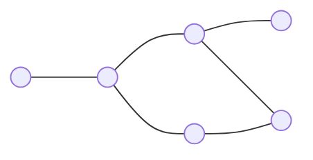

Пусть $V$ — непустое конечное множество [/]. Через $V^2$ обозначим множество всех двухэлементных подмножеств(всевозможные сочетания из двух элементов) из $V$. 

<u>Обыкновенным (простым) графом $G$</u> называется пара множеств $(V, E)$, где $E$ — произвольное подмножество из $V^2$. Элементы множеств $V$ и $E$ называют соответсвенно <u>вершинами</u> и <u>ребрами</u> графа $G$. Множества вершин и рёбер графа $G$ будем обозначать также через $VG$ и $EG$. 
Обыкновенные графы удобно представлять в виде диаграмм(рисунков), на которых вершинам соответствеют выделенные точки, а ребрам — непрерывные кривые, соединяющие эти точки.

**Пример:**

Различные рёбра, соединяющие две заданные вершины, называются кратными.
Рёбра, соединяющие верщину саму с собой, называют петлями.

Более точно, графом называют тройку $(V, E, \varphi)$, где $V \neq \varnothing$, a $\varphi : E \rightarrow V^2 \cup V$. Если множества 